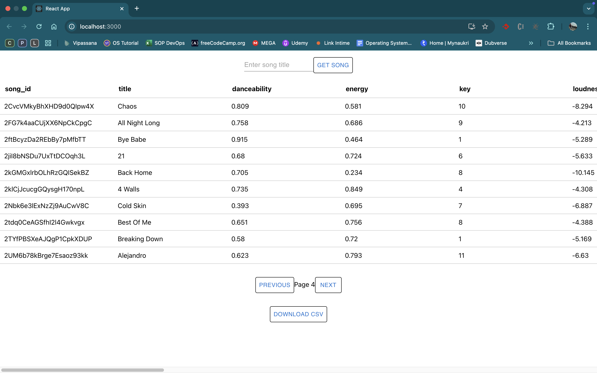
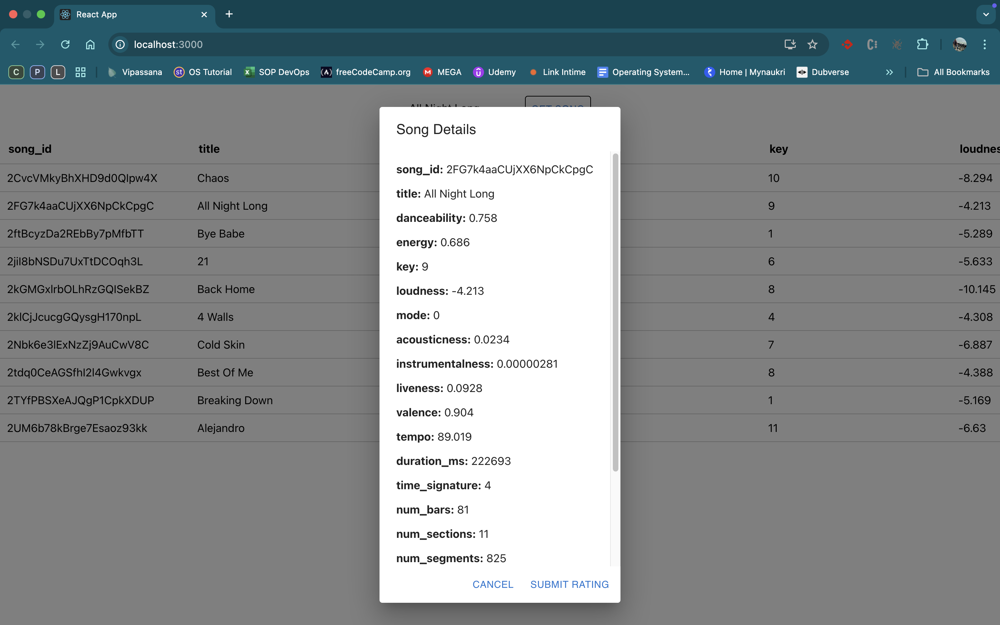
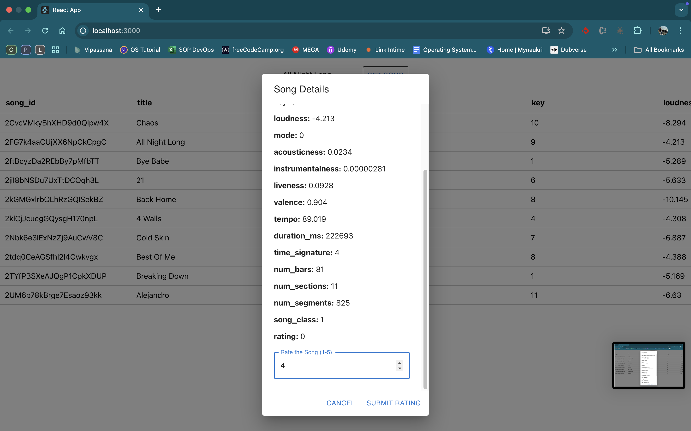
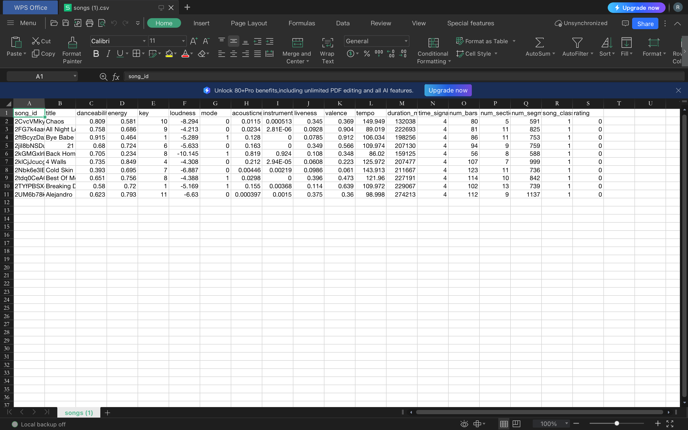

# To run complete application on docker

## 1. Follow Step 1 and 2 from Django README.md
[Django README.md](./songproject/README.md)

## 2. Start docker containers

```bash
docker compose up -d --build
```

## 3. Stop containers

```bash
docker compose down
```

## 3. Frontend is now acessible on
[http://localhost:3000](http://localhost:3000)

## 4. Screenshots of application




